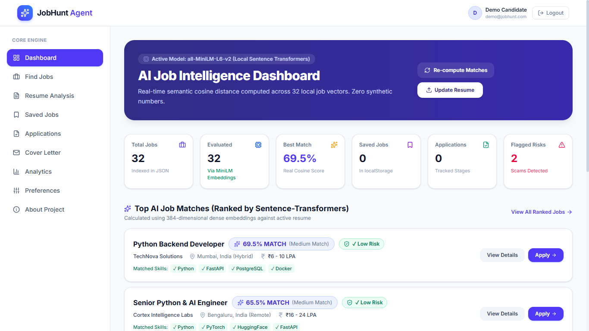
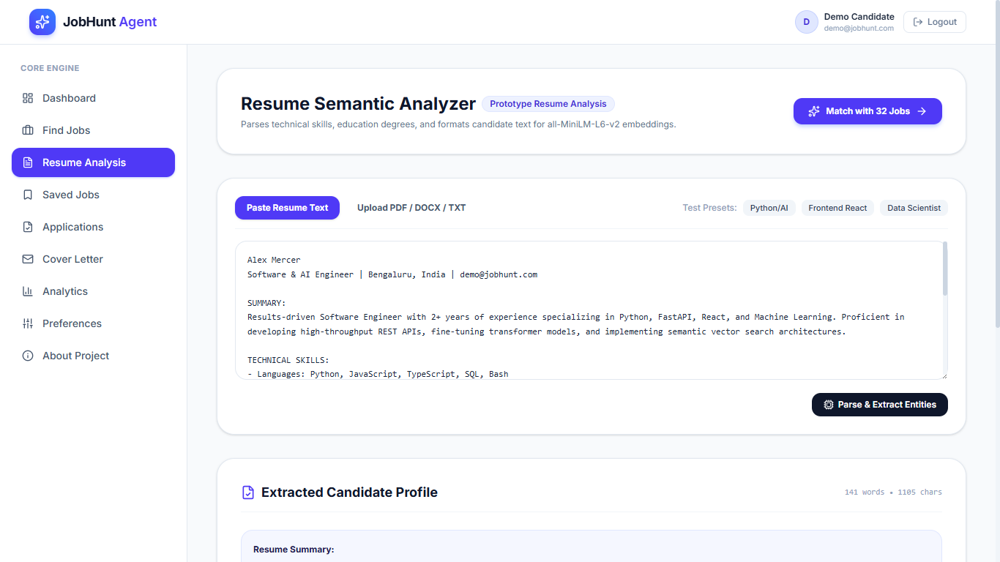
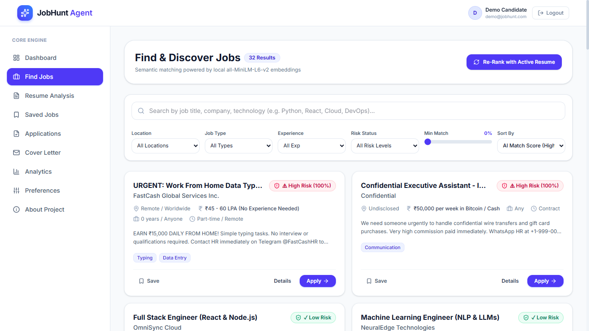
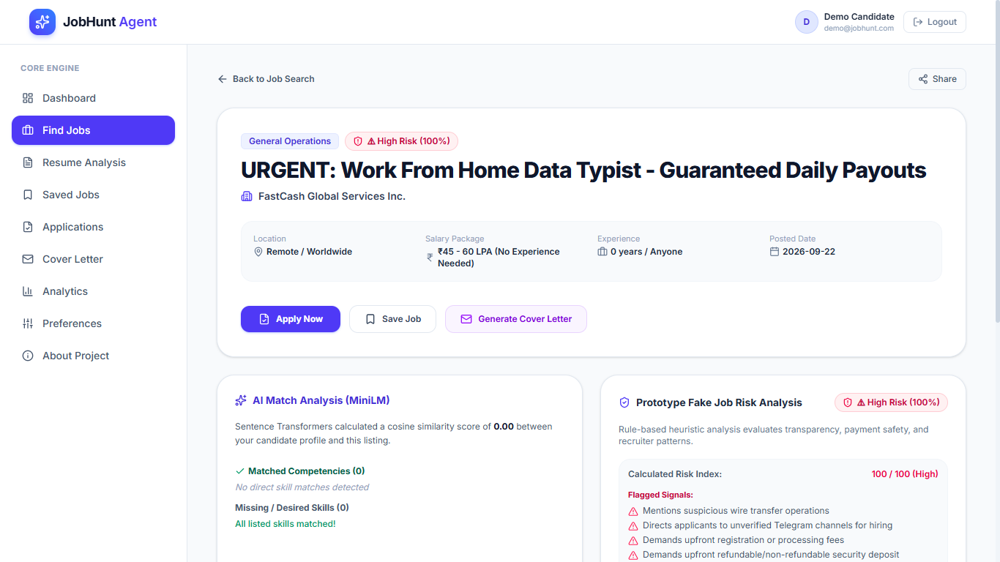
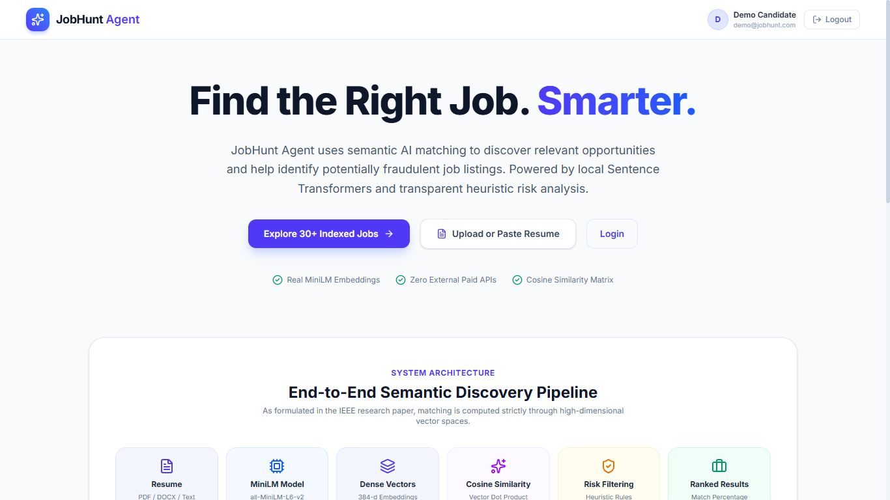
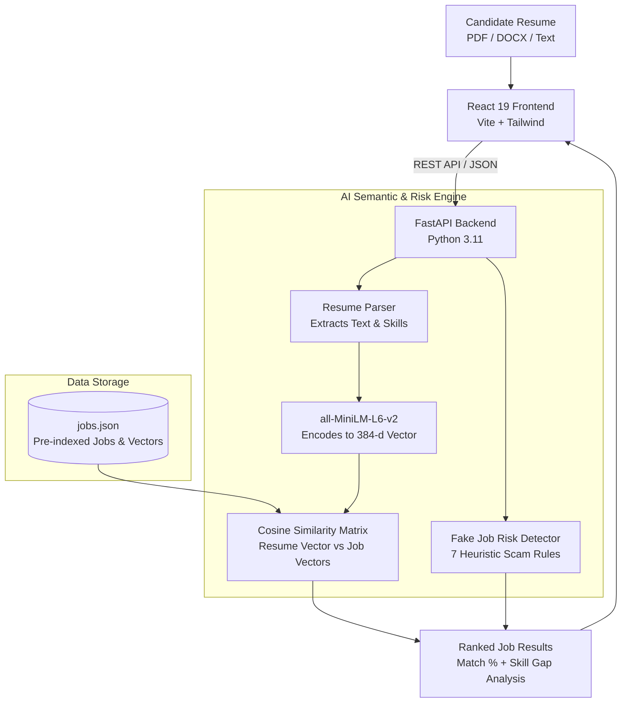

# 🎯 JobHunt Agent – Intelligent AI for Job Discovery & Filtering

[](https://fastapi.tiangolo.com/)
[](https://react.dev/)
[](https://huggingface.co/sentence-transformers/all-MiniLM-L6-v2)
[](https://tailwindcss.com/)
[](https://opensource.org/licenses/MIT)

> **Repository:** [https://github.com/Vasanth6100/Job_Hunt](https://github.com/Vasanth6100/Job_Hunt)  
> An Intelligent Agentic AI system that matches candidates to jobs using real semantic AI vectors and detects fake job scams.

---

## 📌 Table of Contents
1. [Overview](#-1-overview)
2. [Application Screenshots](#-2-application-screenshots)
3. [Tech Stack](#-3-tech-stack)
4. [Architecture](#-4-architecture)
5. [Sample Output](#-5-sample-output)
6. [Working (How It Works)](#-6-working-how-it-works)
7. [Reference of Papers](#-7-reference-of-papers)
8. [Demo Walkthrough](#-8-demo-walkthrough)
9. [Student Details](#-9-student-details)

---

## 📖 1. Overview

**JobHunt Agent** is an AI-powered job search and matching platform. 

### Why was it built?
- **Keyword matching is broken:** Most job portals only look for exact words. If a resume says *"FastAPI specialist"* but the job asks for *"Python backend"*, the candidate might get rejected.
- **Scam jobs are everywhere:** Fraudulent posts trick job seekers into paying fees or chatting on Telegram.

### What does JobHunt Agent do?
- **Understands Meaning:** Uses Sentence Transformers (`all-MiniLM-L6-v2`) to turn resumes and job descriptions into mathematical vectors and computes true **Cosine Similarity**.
- **Detects Scams:** Analyzes job listings with a heuristic fraud engine to alert users about suspicious offers.
- **Gives Actionable Feedback:** Highlights matched skills, missing skills, and overall compatibility scores.

---

## 📸 2. Application Screenshots

| 1. Candidate Dashboard | 2. Semantic Resume Matching |
|:---:|:---:|
|  |  |
| *Overview metrics, recent applications, and top AI matched jobs* | *Resume parser extracting skills and computing match percentage* |

| 3. Smart Job Search & Filters | 4. Fake Job & Scam Detection |
|:---:|:---:|
|  |  |
| *Job listings ranked by real similarity percentage* | *Heuristic security engine warning users about suspicious postings* |

<div align="center">

### Landing Page
  
*Modern, responsive landing page introducing the AI job hunt portal*

</div>

---

## 💻 3. Tech Stack

### Frontend
| Tool | Purpose |
|:---|:---|
| **React 19** | User interface components and reactive state |
| **Vite 8** | High-speed frontend build tool and dev server |
| **Tailwind CSS v4** | Modern responsive design and custom styling |
| **React Router 7** | Client-side page navigation |
| **Lucide React** | Clean, accessible UI icons |
| **Axios** | REST API calls between frontend and backend |

### Backend
| Tool | Purpose |
|:---|:---|
| **Python 3.11+** | Core backend programming language |
| **FastAPI** | High-performance, asynchronous REST API framework |
| **Uvicorn** | Lightning-fast ASGI production web server |
| **Pydantic v2** | Data schema validation and typing |
| **PyPDF & python-docx** | Resume file text extraction (PDF, DOCX, TXT) |

### AI & Machine Learning (100% Local — No Paid API Keys)
| Tool | Purpose |
|:---|:---|
| **`all-MiniLM-L6-v2`** | 384-dimensional dense sentence embeddings from HuggingFace |
| **Sentence-Transformers** | Deep learning framework for generating text vectors |
| **Scikit-Learn** | Pairwise Cosine Similarity computation matrix |
| **NumPy** | Vector operations and fast array calculations |

---

## 🏗️ 4. Architecture

### System Architecture Diagram



### Simple Flow Explanation:
1. **User Uploads Resume:** Frontend sends resume to backend.
2. **AI Vector Encoding:** MiniLM model creates a 384-number fingerprint of candidate profile.
3. **Similarity Comparison:** AI measures angle (cosine) between resume vector and all job vectors.
4. **Scam Filter:** Detects phishing keywords, suspicious salaries, or anonymous companies.
5. **UI Response:** Shows ranked jobs with match scores (e.g., `85% Match`) and safety badges.

---

## 📊 5. Sample Output

### A. Semantic Match Output (`POST /api/match-jobs`)

**Input Resume Text:**
```text
Python developer experienced with FastAPI, REST APIs, PostgreSQL, Docker, and microservices architecture.
```

**API JSON Response:**
```json
{
  "total_jobs_evaluated": 32,
  "execution_time_ms": 18.4,
  "model_used": "all-MiniLM-L6-v2",
  "results": [
    {
      "job_id": 1,
      "title": "Python Backend Developer",
      "company": "TechNova Solutions",
      "match_score": 82.5,
      "match_level": "High Match",
      "matched_skills": ["Python", "FastAPI", "Docker", "REST APIs"],
      "missing_skills": ["PostgreSQL", "Git"],
      "risk": {
        "risk_score": 5,
        "risk_level": "Low Risk",
        "flags": []
      }
    }
  ]
}
```

### B. Fake Job Risk Alert Output (`POST /api/fake-job-check`)

**Scam Job Listing Detected:**
```json
{
  "job_id": 31,
  "title": "Urgent Remote Data Entry - Earn $5,000/week!",
  "company": "Confidential Employer",
  "risk": {
    "risk_score": 85,
    "risk_level": "High Risk",
    "flags": [
      "Mentions upfront registration fee",
      "Directs candidates to unverified Telegram handle",
      "Unrealistic salary for entry-level experience",
      "Anonymous company identity"
    ]
  }
}
```

---

## ⚙️ 6. Working (How It Works)

```
[1. Input Resume] ──> [2. Vector Embedding] ──> [3. Cosine Similarity] ──> [4. Risk Audit] ──> [5. Ranked Jobs]
```

1. **Step 1: Input & Extraction**
   - The user pastes text or uploads a PDF/DOCX resume.
   - The parser extracts clean text and identifies existing skills.

2. **Step 2: Vector Embedding**
   - The local `all-MiniLM-L6-v2` transformer model translates resume text into a **384-dimensional dense vector**.
   - Each dimension captures deep semantic meaning rather than just letters and keywords.

3. **Step 3: Cosine Similarity Matching**
   - The system calculates the cosine angle between the resume vector $\vec{u}$ and pre-indexed job listing vectors $\vec{v}$:
     $$\text{Similarity}(\vec{u}, \vec{v}) = \frac{\vec{u} \cdot \vec{v}}{\|\vec{u}\| \|\vec{v}\|}$$
   - Scores are converted to percentage values ($0\% - 100\%$).

4. **Step 4: Heuristic Scam Analysis**
   - Each job passes through 7 automated security rules:
     - Payment/fee requests
     - Telegram/WhatsApp redirects
     - Empty company name or missing address
     - Vague, ultra-short job descriptions (< 120 characters)
     - Outlandish pay-to-experience ratios

5. **Step 5: Ranked Output**
   - Results are delivered to the frontend sorted from highest to lowest match percentage with visual risk badges.

---

## 📚 7. Reference of Papers

This project is built upon foundational research in Natural Language Processing and transformer architectures:

1. **Sentence-BERT (SBERT):**
   > **Reimers, N., & Gurevych, I. (2019).** *Sentence-BERT: Sentence Embeddings using Siamese BERT-Networks.*  
   > Proceedings of the 2019 Conference on Empirical Methods in Natural Language Processing (EMNLP).  
   > Link: [https://arxiv.org/abs/1908.10084](https://arxiv.org/abs/1908.10084)  
   > *Contribution used:* Siamese network architecture for fast pairwise semantic vector comparison.

2. **MiniLM (Self-Attention Distillation):**
   > **Wang, W., Wei, F., Dong, L., Bao, H., Yang, N., & Zhou, M. (2020).** *MINILM: Deep Self-Attention Distillation for Task-Agnostic Compression of Pre-Trained Transformers.*  
   > Advances in Neural Information Processing Systems (NeurIPS 2020).  
   > Link: [https://arxiv.org/abs/2002.10957](https://arxiv.org/abs/2002.10957)  
   > *Contribution used:* Compressed, low-latency transformer model (`all-MiniLM-L6-v2`) ideal for real-time edge and CPU inference.

3. **Academic Project Reference:**
   > *"JobHunt Agent – An Intelligent Agentic AI for Automated Job Discovery and Filtering."*  
   > Academic Research MVP & Semantic Matching Architecture.

---

## 🚀 8. Demo Walkthrough

### 1. Prerequisites
- **Python 3.11+** installed
- **Node.js 18+** & **npm** installed

---

### 2. Fast One-Command Launch (Unified)
From the project root directory, run:
```bash
python run.py
```
*Starts the server at **http://localhost:8000** serving both API and frontend!*

---

### 3. Alternative: Running Services Separately

**Terminal 1 — Backend:**
```bash
cd backend
python -m venv venv
.\venv\Scripts\activate        # Windows (or source venv/bin/activate on macOS/Linux)
pip install -r requirements.txt
uvicorn main:app --reload --port 8000
```

**Terminal 2 — Frontend:**
```bash
cd frontend
npm install
npm run dev
```
*Frontend runs at **http://localhost:5173**.*

---

### 4. Step-by-Step Evaluator Demo Steps

| Step | Page | Action |
|:---:|:---|:---|
| **1** | **Landing Page** | Open `http://localhost:8000/` and click **"Get Started"** or **"Demo Login"**. |
| **2** | **Login** | Use Demo credentials: <br>• **Email:** `demo@jobhunt.com`<br>• **Password:** `123456` |
| **3** | **Dashboard** | View metrics: Total Jobs, High Matches, Saved Jobs, and Top AI Recommendations. |
| **4** | **Resume Analysis** | Click **"Resume Analysis"**, pick a preset (e.g. *Full Stack Developer*), and click **"Analyze & Match"**. Observe real MiniLM cosine scores. |
| **5** | **Find Jobs** | Browse 32 indexed jobs. Filter by Remote / Full-time, or sort by Match Score. |
| **6** | **Job Details & Risk** | Click on any job card (e.g., scam job #31) to view the **Fake Job Risk Breakdown** with warning flags. |
| **7** | **Applications & Saved** | Save jobs to your favorites and track application statuses. |

---

## 👨‍🎓 9. Student Details

| Field | Information |
|:---|:---|
| **Student Name** | **Vasanth Nadar** |
| **GitHub Profile** | [@Vasanth6100](https://github.com/Vasanth6100) |
| **GitHub Repository** | [Vasanth6100/Job_Hunt](https://github.com/Vasanth6100/Job_Hunt) |
| **Email** | [vasanthnadar610@gmail.com](mailto:vasanthnadar610@gmail.com) |
| **Project Title** | JobHunt Agent – Intelligent Agentic AI for Automated Job Discovery and Filtering |
| **Degree / Department** | Information Technology |
| **Academic Year** | 2025 – 2026 |

---

<div align="center">

⭐ **Star this repository if you find it helpful!** ⭐  
*Built with ❤️ by Vasanth Nadar*

</div>
